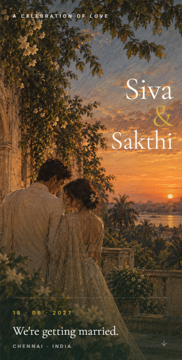
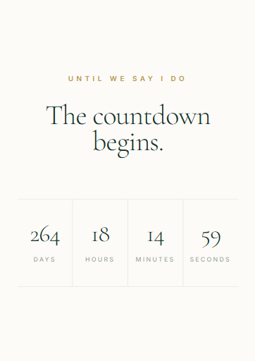
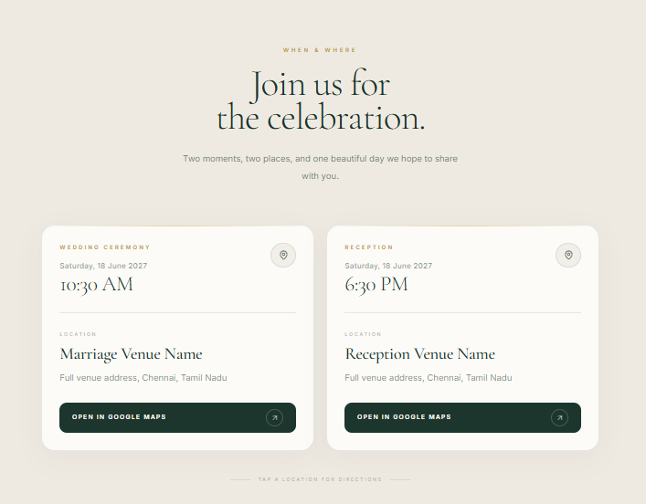
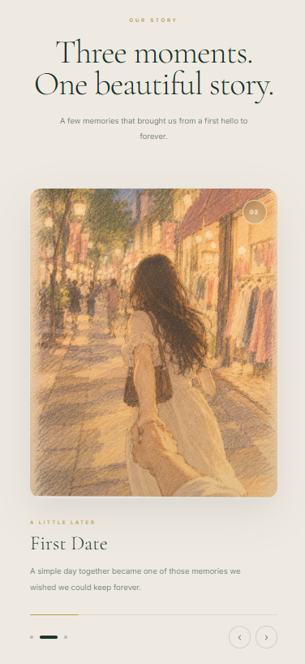
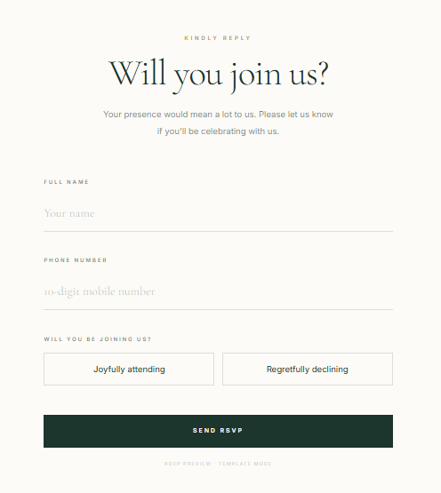

<div align="center">

# Ever After

**A beautifully crafted digital wedding invitation template.**

A modern, elegant and highly animated wedding invitation built with Next.js, designed to feel personal, intimate and more like a piece of premium stationery than a conventional website.

[](https://everafter-gamma.vercel.app/)<br>
[](https://nextjs.org/)
[](https://www.typescriptlang.org/)
[](https://tailwindcss.com/)
[](https://vercel.com/)

🌐 **Live Website:** <a href="https://everafter-gamma.vercel.app/" target="_blank" rel="noopener noreferrer">Open Ever After</a>

</div>

---

## About

Ever After is a modern digital wedding invitation designed to turn a traditional wedding card into an immersive web experience.

Instead of presenting information as a collection of ordinary website sections, the design focuses on **typography, spacing, photography, subtle motion, storytelling and visual rhythm**.

The invitation includes the couple's introduction, wedding countdown, venue information, personal memories, RSVP, frequently asked questions and a closing section.

The project was designed as a **reusable wedding invitation template**, making it possible to replace the couple's information, dates, venues, images and story without rebuilding the entire application.

---

## ✨ Features

### Hero Experience

- Full-screen wedding introduction
- Elegant editorial typography
- Couple names and wedding date
- Atmospheric background artwork
- Responsive image composition
- Subtle entrance animations

### Countdown

- Live wedding countdown
- Days, hours, minutes and seconds
- Updates automatically every second
- Client-side calculation to avoid SSR hydration mismatches
- Scroll-triggered entrance animation

### Venue Section

- Separate ceremony and reception details
- Wedding date and time
- Venue name and address
- Google Maps integration
- Responsive venue cards
- Mobile-friendly navigation buttons

### Our Story

A visual timeline presenting important moments from the couple's relationship:

- First Meet
- First Date
- The Proposal

Each memory contains:

- Hand-painted / artistic imagery
- Timeline numbering
- Short descriptions
- Editorial typography
- Rounded image presentation
- Scroll-based animations
- Subtle dreamy movement

### RSVP

- Dedicated RSVP section
- Guest response interface
- Designed to integrate with a backend or database later
- Prepared as a template-friendly component

### FAQ

- Frequently asked wedding questions
- Clean expandable layout
- Mobile-friendly interaction

### Motion & Interaction

- GSAP animations
- ScrollTrigger-based reveals
- Smooth scrolling
- Section entrance animations
- Staggered content animations
- Subtle image transitions
- Responsive motion behavior

---

## 🎨 Design Philosophy

The design intentionally avoids the appearance of a conventional wedding website.

The visual direction combines:

- Editorial typography
- Warm ivory backgrounds
- Deep forest green
- Muted gold accents
- Handmade-paper aesthetics
- Soft photographic artwork
- Generous whitespace
- Rounded image corners
- Subtle borders
- Slow, understated motion

The goal is to make the website feel closer to a **physical wedding invitation brought to life digitally**.

---

## 🖼️ Screenshots

<div align="center">

<table>
<tr>
<td align="center">
<strong>Hero</strong><br><br>

</td>

<td align="center">
<strong>Countdown</strong><br><br>

</td>
</tr>

<tr>
<td align="center">
<strong>Venue</strong><br><br>

</td>

<td align="center">
<strong>Our Story</strong><br><br>

</td>
</tr>

<tr>
<td align="center">
<strong>RSVP</strong><br><br>

</td>

<td align="center">
</td>
</tr>
</table>

</div>

## 🛠️ Tech Stack

| Layer | Technology |
|-------|------------|
| Framework | Next.js |
| Language | TypeScript |
| UI | React |
| Styling | Tailwind CSS |
| Animations | GSAP |
| Scroll Animation | GSAP ScrollTrigger |
| Icons | Lucide React |
| Deployment | Vercel |

The project uses a component-based architecture so individual sections can be modified independently without affecting the rest of the invitation.

---

## 🏗️ Architecture

```text
                    ┌──────────────────────┐
                    │      Next.js App     │
                    └──────────┬───────────┘
                               │
              ┌────────────────┼────────────────┐
              │                │                │
              ▼                ▼                ▼
           Hero            Countdown          Venue
              │                │                │
              └────────────────┼────────────────┘
                               │
                               ▼
                         Our Story
                               │
                               ▼
                             RSVP
                               │
                               ▼
                             FAQ
                               │
                               ▼
                            Footer
````

Animations are handled independently through GSAP and ScrollTrigger.

---

## 📁 Project Structure

```text
ever-after/
│
├── app/
│   ├── layout.tsx
│   ├── page.tsx
│   └── globals.css
│
├── components/
│   │
│   ├── animations/
│   │   └── ScrollAnimations.tsx
│   │
│   ├── countdown/
│   │   └── Countdown.tsx
│   │
│   ├── hero/
│   │   └── Hero.tsx
│   │
│   ├── venue/
│   │   └── VenueSection.tsx
│   │
│   ├── story/
│   │   └── OurStory.tsx
│   │
│   ├── rsvp/
│   │   └── RSVP.tsx
│   │
│   ├── faq/
│   │   └── FAQ.tsx
│   │
│   ├── footer/
│   │   └── WeddingFooter.tsx
│   │
│   └── smooth-scroll/
│       └── SmoothScroll.tsx
│
├── public/
│   ├── images/
│   └── ...
│
├── package.json
├── tsconfig.json
├── next.config.ts
├── postcss.config.mjs
├── eslint.config.mjs
└── README.md
```

---

## 🚀 Getting Started

### Prerequisites

Make sure you have:

* Node.js 18+
* npm
* Git

---

### 1. Clone the repository

```bash
git clone https://github.com/jbmsacps-stack/YOUR-REPOSITORY.git
cd YOUR-REPOSITORY
```

---

### 2. Install dependencies

```bash
npm install
```

---

### 3. Start the development server

```bash
npm run dev
```

Open:

```text
http://localhost:3000
```

---

## 🏭 Production Build

To create a production build:

```bash
npm run build
```

Then run the production server:

```bash
npm start
```

The production application will be available at:

```text
http://localhost:3000
```

---

## ☁️ Deployment

The project is designed for deployment on Vercel.

### Deploy with Vercel

1. Push the project to GitHub.
2. Open Vercel.
3. Import the GitHub repository.
4. Allow Vercel to detect the Next.js configuration.
5. Click **Deploy**.

No database is required for the current template version.

---

## 🗄️ Database

Supabase is intentionally **not required** for the current version.

The project is currently designed as a reusable static wedding invitation template.

A backend/database can be introduced later for features such as:

* RSVP storage
* Guest management
* Attendance tracking
* Private invitation links
* Guest messages
* Admin dashboard

This keeps the template lightweight and easy to deploy.

---

## 📍 Google Maps

Each venue can contain its own Google Maps search URL.

Example:

```tsx
const venues = [
  {
    type: "Wedding Ceremony",
    date: "Saturday, 18 June 2027",
    time: "10:30 AM",
    name: "Marriage Venue Name",
    address: "Full venue address, Chennai, Tamil Nadu",
    mapsUrl:
      "https://www.google.com/maps/search/?api=1&query=Marriage+Venue+Name+Chennai",
  },
];
```

This allows each ceremony or reception location to have its own directions button.

---

## ⏳ Countdown

The countdown is based on the wedding date:

```tsx
const weddingDate = new Date(
  "2027-06-18T10:30:00+05:30"
).getTime();
```

The timer calculates:

```text
Days
Hours
Minutes
Seconds
```

The initial countdown state is rendered consistently on the server and updated after the component mounts, preventing the hydration mismatch that can occur when `Date.now()` is evaluated during server rendering.

---

## 🎞️ Animation System

Animations are handled using **GSAP** and **ScrollTrigger**.

Example animation flow:

```text
Section enters viewport
        │
        ▼
   Eyebrow fades in
        │
        ▼
    Title rises
        │
        ▼
     Divider expands
        │
        ▼
   Content appears
        │
        ▼
   Cards stagger in
```

The animations are intentionally subtle rather than excessive.

The goal is to make scrolling feel natural while preserving readability and performance.

---

## 📱 Responsive Design

The invitation is designed primarily around a mobile experience while remaining responsive on larger screens.

```text
Mobile
  ↓
Tablet
  ↓
Desktop
```

Particular attention is given to:

* Typography scaling
* Image cropping
* Section spacing
* Button sizing
* Venue cards
* Story cards
* Countdown columns
* Touch-friendly interactions

---

## 🧩 Customization

The template can be adapted for a different wedding by changing:

### Couple

```text
Sarah & Alexander
```

### Date

```text
18 June 2027
```

### Ceremony

```text
10:30 AM
Marriage Venue Name
```

### Reception

```text
6:30 PM
Reception Venue Name
```

### Story

```text
First Meet
First Date
The Proposal
```

### Images

Replace the files inside:

```text
public/images/
```

while keeping the component references intact.

---

## 🔮 Future Improvements

* [ ] Supabase-powered RSVP storage
* [ ] Guest-specific invitation links
* [ ] RSVP confirmation messages
* [ ] Guest management dashboard
* [ ] WhatsApp RSVP integration
* [ ] Music / ambient audio option
* [ ] More story transition effects
* [ ] Image preloading and optimization
* [ ] Progressive image loading
* [ ] Multiple wedding themes
* [ ] Theme customization panel
* [ ] Shareable invitation URLs
* [ ] QR-code invitation support
* [ ] PWA support

---

## 📌 Project Status

**Current Status: Production-ready template**

The core invitation experience is complete, including:

* Hero
* Countdown
* Venue information
* Our Story
* RSVP interface
* FAQ
* Footer
* Scroll animations
* Responsive layout
* Google Maps integration

The backend/database layer is intentionally left out of the current template.

---

## 👨‍💻 Author

**Joshua Baskar** — Aspiring Full-Stack Developer

📬 **Email:** [jbmsacps@gmail.com](mailto:jbmsacps@gmail.com)

🔗 **GitHub:** [https://github.com/jbmsacps-stack](https://github.com/jbmsacps-stack)

🔗 **LinkedIn:** [https://www.linkedin.com/in/joshua-baskar-2b4a88381/](https://www.linkedin.com/in/joshua-baskar-2b4a88381/)

---

## 📄 Copyright & Usage Terms

**Ever After** · Copyright © 2026 Joshua Baskar · All rights reserved.

### Permitted Uses

* Viewing and studying the source code for personal learning
* Referencing the project for academic or portfolio purposes with attribution
* Private experimentation and modification
* Sharing links to the repository or live website with proper credit

### Restricted Uses

The following require explicit written permission from the author:

* Republishing the project as an original work
* Commercially selling the template
* Redistributing the project under another name
* Claiming authorship or ownership
* Monetizing substantial portions of the source code
* Selling modified versions of the template

Commercial licensing can be discussed directly with the author.

📬 **Contact:** [jbmsacps@gmail.com](mailto:jbmsacps@gmail.com)

---

## ⚖️ Usage Summary

| Use Case                             | Status                 |
| ------------------------------------ | ---------------------- |
| Personal learning & study            | ✅ Permitted            |
| Private experimentation              | ✅ Permitted            |
| Academic reference with credit       | ✅ Permitted            |
| Portfolio reference with attribution | ✅ Permitted            |
| Sharing repository link              | ✅ Permitted            |
| Public redistribution                | ⚠️ Permission required |
| Commercial use                       | ⚠️ Permission required |
| Selling modified versions            | ❌ Not permitted        |
| Claiming ownership                   | ❌ Not permitted        |

---

<div align="center">

**Ever After**

*An invitation made for a day worth remembering.*

<br>

*Last updated: September 2026 · Created by Joshua Baskar*

⭐ If you found this project useful, a star is appreciated.

</div>
```

### One thing I'd change before you paste it

Don't leave:

```text
YOUR_VERCEL_URL
YOUR-REPOSITORY
```

in the final README. Once you've deployed, replace those two values with the actual Vercel and GitHub URLs.

Also, because this is a **template**, I would keep the README honest about Supabase: **don't list Supabase in the current tech stack just because you created a project for it.** Since we're deliberately leaving the database out for now, the README should reflect the actual deployed architecture.
